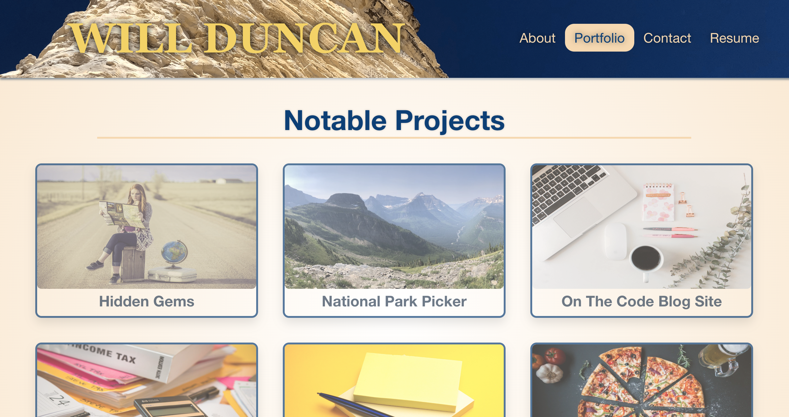
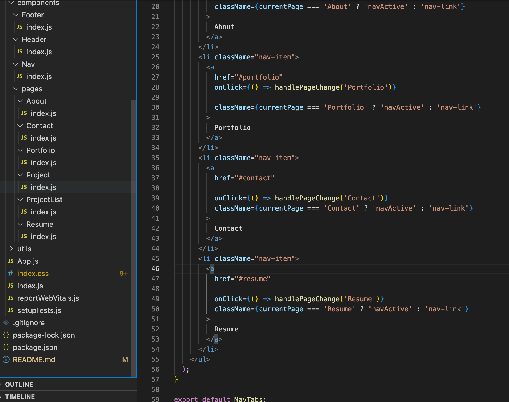
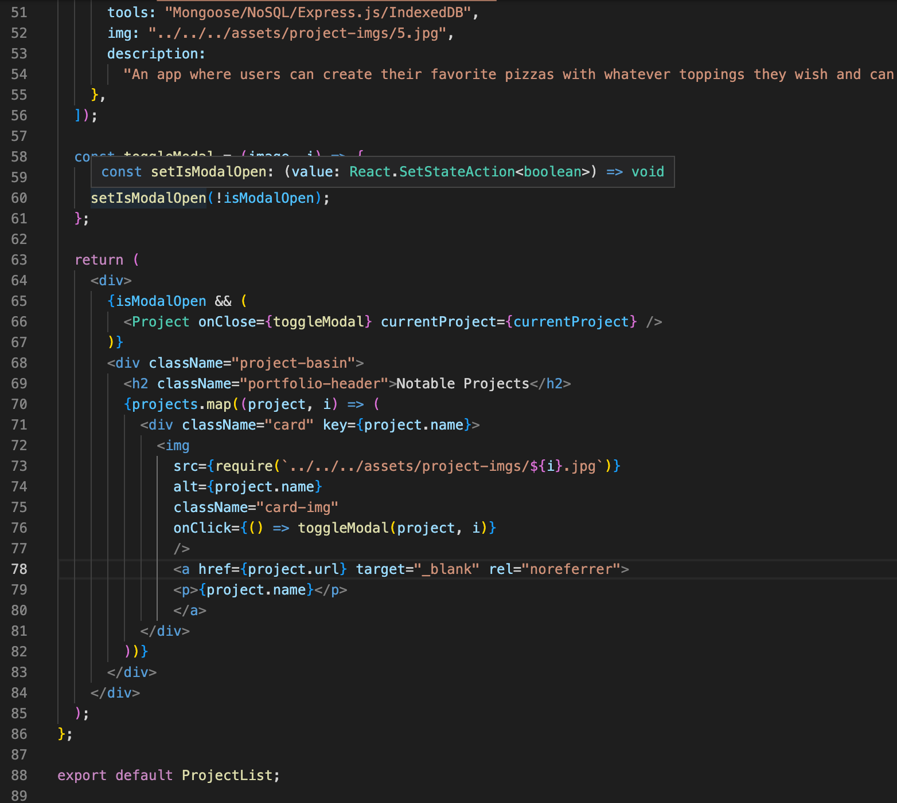

# Will Duncan's Professional Portfolio
Will Duncan's Professional Portfolio

        

## Table of Contents
- [Description](#description)
- [Installation](#installation)
- [Usage](#usage)
- [Credits](#credits)
- [Contributing](#contributing)
- [Tests](#tests)
- [Questions](#questions)
- [License](#license)  
        

## Description

AS AN employer looking for candidates with experience building single-page applications

I WANT to view a potential employee's deployed React portfolio of work samples

SO THAT I can assess whether they're a good candidate for an open position

I designed this portfolio to show off my best coding projects, resume, and abilities so that potential employers can easily and enjoyably access them. The website itself will be another way to show off my coding skills, particularly with React.js.

Once complete, the program should operate so that:

GIVEN a single-page application portfolio for a web developer

WHEN I load the portfolio

THEN I am presented with a page containing a header, a section for content, and a footer

WHEN I view the header

THEN I am presented with the developer's name and navigation with titles corresponding to different sections of the portfolio

WHEN I view the navigation titles

THEN I am presented with the titles About Me, Portfolio, Contact, and Resume, and the title corresponding to the current section is highlighted

WHEN I click on a navigation title

THEN I am presented with the corresponding section below the navigation without the page reloading and that title is highlighted

WHEN I load the portfolio the first time

THEN the About Me title and section are selected by default

WHEN I am presented with the About Me section

THEN I see a recent photo or avatar of the developer and a short bio about them

WHEN I am presented with the Portfolio section

THEN I see titled images of six of the developer’s applications with links to both the deployed applications and the corresponding GitHub repository

WHEN I am presented with the Contact section

THEN I see a contact form with fields for a name, an email address, and a message

WHEN I move my cursor out of one of the form fields without entering text

THEN I receive a notification that this field is required

WHEN I enter text into the email address field

THEN I receive a notification if I have entered an invalid email address

WHEN I am presented with the Resume section

THEN I see a link to a downloadable resume and a list of the developer’s proficiencies

WHEN I view the footer

THEN I am presented with text or icon links to the developer’s GitHub and LinkedIn profiles, and their profile on a third platform (Stack Overflow, Twitter) 

I began with the framework, deciding to meld the file layout shown in Module 20 with they layout of activity 4 of Module 20's in-class assignments. After some trial and error, the components were set up in a way that satisfied me and I moved on to the styling. I decided to try and avoid using bootstrap in order to lower the amount of dependencies and keep reaction time quick. I styled component by component, beginning with the header and footer before moving on to the About page, Resume page, Contact page, and then Portfolio page before going back and completing the media queries. 

## Installation

Links to the repository and the deployed page can be found at [Questions](#questions).

If you clone the repo you must run the command "npm install" on the Terminal/Command Line and download the dependencies. 

 

## Usage

Once the project is cloned and the dependencies downloaded, type "npm start" to run the program. 

A screenshot of the About page, Portfolio page, and Contact page are below. Note that the Contact page is providing validation and feedback on the inputs.

Screenshots of the Nav component's index.js and ProjectList's index.js are below: 

## Credits

 The license was picked from [https://choosealicense.com/](https://choosealicense.com/).The WHEN/THEN section of this README was based off the project assignment Acceptance Criteria. Most influence was taken from Oh Snap of Module 20 and activity 4 of Module 20's in-class assignments. Many features were also translated from my original Professional Portfolio of Challenge 2. Stack Overflow, MDN Web Docs, W3, and Google were critical to our success. The icons in the footer and for the tab were taken from flaticon: [https://www.flaticon.com/](https://www.flaticon.com/free-icons/book). They were designed by Roundicons Premium, Pixel Buddha and Freepik. Images were for Budget Tracker were taken from Pixabay. 

## Contributing

If you make changes, test it locally on a branch before pushing to main. Clone from the github site and make sure to create your own .env file with your own credentials.

## Tests

No tests written were made for this project, but Chrome DevTools is a critical tool in letting you test the program's ability to run in different environments to test its offline capabilities. 

## Questions

The github repository to this project is below:

[https://github.com/willjduncan/exuberant-peaches.git](https://github.com/willjduncan/exuberant-peaches.git)

The live website is deployed on Github. The URL is below:

[https://willjduncan.github.io/exuberant-peaches/](https://willjduncan.github.io/exuberant-peaches/)

For any additional questions, I can be reached at the following

Will Duncan: willdunc12@gmail.com
Github: [https://github.com/willjduncan](https://github.com/willjduncan)

## License

[view license link here](https://choosealicense.com/licenses/mit/)

        
MIT License

Copyright (c) [2022] [willjduncan]

Permission is hereby granted, free of charge, to any person obtaining a copy
of this software and associated documentation files (the "Software"), to deal
in the Software without restriction, including without limitation the rights
to use, copy, modify, merge, publish, distribute, sublicense, and/or sell
copies of the Software, and to permit persons to whom the Software is
furnished to do so, subject to the following conditions:

The above copyright notice and this permission notice shall be included in all
copies or substantial portions of the Software.

THE SOFTWARE IS PROVIDED "AS IS", WITHOUT WARRANTY OF ANY KIND, EXPRESS OR
IMPLIED, INCLUDING BUT NOT LIMITED TO THE WARRANTIES OF MERCHANTABILITY,
FITNESS FOR A PARTICULAR PURPOSE AND NONINFRINGEMENT. IN NO EVENT SHALL THE
AUTHORS OR COPYRIGHT HOLDERS BE LIABLE FOR ANY CLAIM, DAMAGES OR OTHER
LIABILITY, WHETHER IN AN ACTION OF CONTRACT, TORT OR OTHERWISE, ARISING FROM,
OUT OF OR IN CONNECTION WITH THE SOFTWARE OR THE USE OR OTHER DEALINGS IN THE
SOFTWARE.